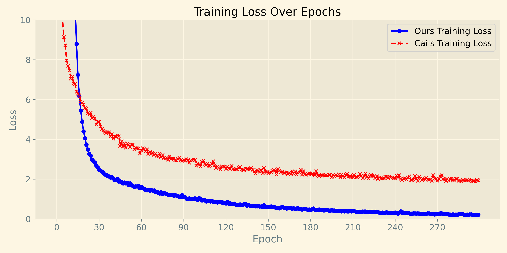
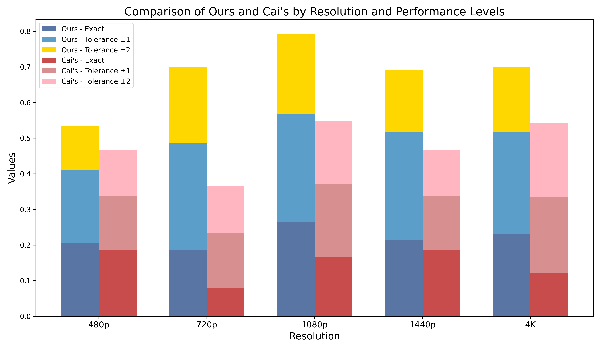

# Using Auto Regressive Model to Predict Encoding Parameters for Consistent Video Quality

<div><center>Using Auto Regressive Model to Predict Encoding Parameters for Consistent Video Quality</center></div>

## Compare Previous Studies
#### 1. Principle Differences

#### 2. Qualitative Results


#### 3. Quantitative Results



## Quick Start

### Prerequisites

- Python 3.8+
- Required libraries listed in `requirements.txt`

### Installation

1. Clone the repository:
    ```bash
    git clone https://github.com/chengzidl/QualityControlforVideo.git
    cd QualityControlforVideo
    ```

2. Install the required libraries:
    ```bash
    pip install -r requirements.txt
    ```

### Usage

1. Prepare your dataset in the specified format.
2. Run the model training script:
    ```bash
    python train.py --data_path /path/to/your/data
    ```

3. Predict encoding parameters using the trained model:
    ```bash
    python predict.py --input /path/to/your/input
    ```

### Results

The model will output the predicted encoding parameters which can be used to maintain consistent video quality.

### Contributing

1. Fork the repository.
2. Create a new branch (`git checkout -b feature-branch`)
3. Commit your changes (`git commit -am 'Add new feature'`)
4. Push to the branch (`git push origin feature-branch`)
5. Create a new Pull Request

### License

This project is licensed under the MIT License - see the [LICENSE](LICENSE) file for details.

### Acknowledgements

- Any acknowledgements or credits you want to give.

